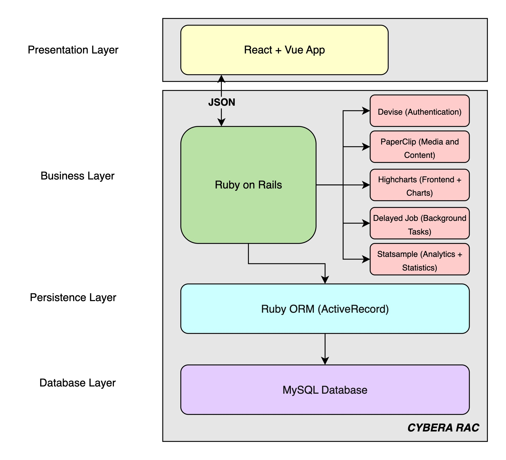
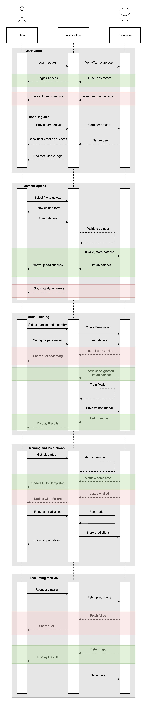
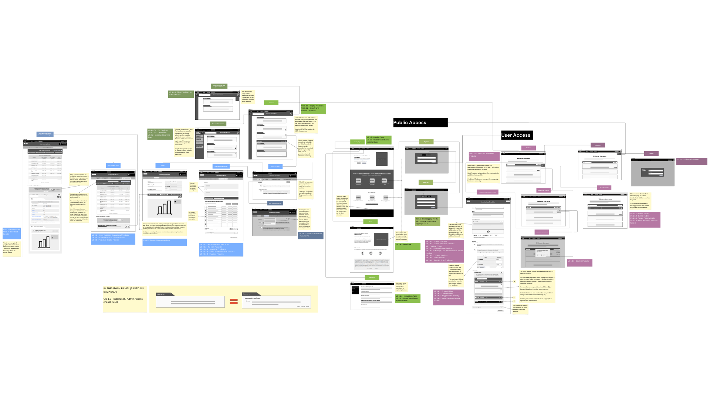

# Software Design

This page includes a short description of the overall architecture style of the system, its high-level system components, and their logical (what data they exchange) and control (how they invoke each other) dependencies.

## High-level Architecture 

*This is a short description of the architecture.*

{target=_blank}

## UML Class Diagram

*This is a short description of logical entities of the domain in a UML diagram.*

{target=_blank}

## Sequence Diagram

*Multiple sequence diagrams depicting the most important scenarios.*

{target=_blank}

## Wireframes

*Looking at the wireframes, anyone should be able to get an idea of what will be developed. Test your wireframes with your client, encourage them to give feedback.*

{target=_blank}

For a clearer look, go [here](https://www.canva.com/design/DAG0JPaxo_k/sMor9R0tpLJT6JhqGsAFkg/view?utm_content=DAG0JPaxo_k&utm_campaign=designshare&utm_medium=link2&utm_source=uniquelinks&utlId=h867f811d61).

## Tech Stack (Everyone)

List the possible tech stack you will be using. Include links and descriptions of any libraries, frameworks, and tools you will be using.

### Backend
* > [Ruby On Rails](https://guides.rubyonrails.org/)
* > [MySQL](https://dev.mysql.com/doc/)
* > Look up C++ / R as applicable (not quite writing the code but may have to parse it as we are working with models.)

### Frontend
* > [React + Typescript](https://react.dev/learn/typescript)
* > [Vite](https://vite.dev/guide/)
* > [React Router](https://reactrouter.com/start/modes#framework)
* > [Tailwind CSS](https://tailwindcss.com/docs/installation/framework-guides/react-router)
* > [Zustand](https://zustand.docs.pmnd.rs/getting-started/introduction)

