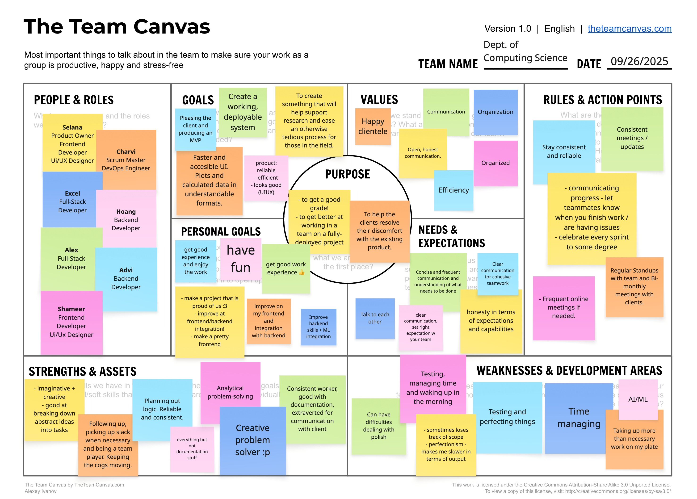

# Teamwork

This section includes three parts:

## 1. Team Canvas

{target=_blank}

## 2. Scrum Roles

We discussed this, as well as what the roles entailed, and decided that the best approach was to start with the two most forthcoming members, and test it out. If any members feel inclined to lead, we will adjust accordingly (and shift to a cyclical strcture for the scrum roles). For the foreseeable future, however, we have:

- Scrum Master  : Yaatheshini Ashok
- Product Owner : Selena Chainani

## 3. Belbin Team Roles

The Belbim Team Roles appear to be quite crucial - largely because they helped us clarify what each of us are good at, comfortable with, and willing to do. It opened up a larger conversation regarding what we all truly do beyond the class, as well as our goals, and this was imperative in deciding the progression of the project and our relations with each other. We found that the Belbin roles were somewhat applicable - more generally, they served as guidelines fthat we could utilize to communicate, if that makes sense.

| Team Member | Preferred Roles | Manageable Roles | Least Preferred Roles | 
|-|-|-|-|
| Advi Islam | SH, TW, IMP | CF, RI , CO | ME, PL, SP |
| Alex Ho | RI, SP, IMP, CF, TW | ME, PL, CO | SH | 
| Excel Ojeifo | PL, CF, IMP | SP, ME, RI | CO, TW, SH |
| Hoang Nguyen | PL, IMP, SP, SH, CF | TW, ME | RI, CO |
| Selena Chainani | PL, CO, CF, IMP | TW, ME, SH, SP | RI |
| Shahmeer Rahman | ME, CF, TW | PL, IMP, CO | SP, SH, RI |
| Yaatheshini Ashok Kumar | CF, CO, SH, TW | IMP, ME, PL | SP, RI | 

### Thinking Roles

#### PL (Plant)

> *Tends to be highly creative and good at solving problems in unconventional ways.* 

>>1. Excel Ojeifo (Preferred)
>>2. Hoang Nguyen (Preferred)
>>3. Selena Chainani (Preferred)
>>4. Shahmeer Rahman (Manageable)
>>5. Yaatheshini Ashok Kumar (Manageable)

#### ME (Monitor Evaluator)

> *Provides a logical eye, making impartial judgements where required and weighs up the team's options in a dispassionate way.* 

>>1. Shahmeer Rahman (Preferred)
>>2. Alex Ho (Manageable)
>>3. Excel Ojeifo (Manageable)
>>4. Hoang Nguyen (Manageable)
>>5. Selena Chainani (Manageable)
>>6. Yaatheshini Ashok Kumar (Manageable)

#### SP (Specialist)

> *Brings in-depth knowledge of a key area to the team.* 

>>1. Alex Ho (Preferred)
>>2. Hoang Nguyen (Preferred)
>>3. Excel Ojeifo (Manageable)
>>4. Selena Chainani (Manageable)

### Action Roles

#### SH (Shaper)

> *Provides the necessary drive to ensure that the team keeps moving and does not lose focus or momentum.* 

>>1. Advi Islam (Preferred)
>>2. Hoang Nguyen (Preferred)
>>3. Yaatheshini Ashok Kumar (Preferred)
>>4. Selena Chainani (Manageable)

#### IMP (Implementer)

> *Needed to plan a workable strategy and carry it out as efficiently as possible.* 

>>1. Advi Islam (Preferred)
>>2. Alex Ho (Preferred)
>>3. Excel Ojeifo (Preferred)
>>4. Hoang Nguyen (Preferred)
>>5. Selena Chainani (Preferred)
>>6. Shahmeer Rahman (Manageable)
>>7. Yaatheshini Ashok Kumar (Manageable)

#### CF (Completer Finisher)

> *Most effectively used at the end of tasks to polish and scrutinise the work for errors, subjecting it to the highest standards of quality control.* 

>>1. Alex Ho (Preferred)
>>2. Excel Ojeifo (Preferred)
>>3. Hoang Nguyen (Preferred)
>>4. Selena Chainani (Preferred)
>>5. Shahmeer Rahman (Preferred)
>>6. Yaatheshini Ashok Kumar (Preferred)
>>7. Advi Islam (Manageable)

### People Roles

#### RI (Resource Investigator)

> *Uses their inquisitive nature to find ideas to bring back to the team.* 

>>1. Alex Ho (Preferred)
>>2. Advi Islam (Manageable)
>>3. Excel Ojeifo (Manageable)

#### TW (Teamworker)

> *Helps the team to gel, using their versatility to identify the work required and complete it on behalf of the team.* 

>>1. Advi Islam (Preferred)
>>2. Alex Ho (Preferred)
>>3. Shahmeer Rahman (Preferred)
>>4. Yaatheshini Ashok Kumar (Preferred)
>>5. Hoang Nguyen (Manageable)
>>6. Selena Chainani (Manageable)

#### CO (Co-ordinator)

> *Needed to focus on the team's objectives, draw out team members and delegate work appropriately.* 

>>1. Selena Chainani (Preferred)
>>2. Yaatheshini Ashok Kumar (Preferred)
>>3. Advi Islam (Manageable)
>>4. Alex Ho (Manageable)
>>5. Shahmeer Rahman (Manageable)